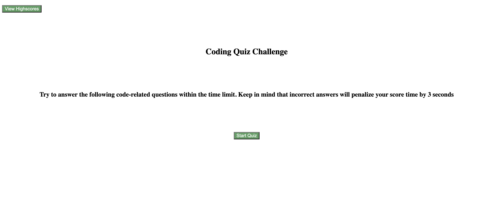
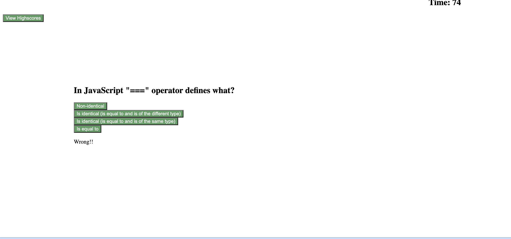
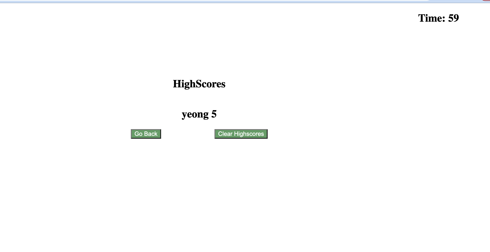

# module-4-challenge
# Coding Quiz

## Description

The following project creates a timed coding quiz on basic javascript that can be used to test the fundamental javascript knowledge of candidates. The quiz starts when the user clicks the "start quiz" button. There are 5 questions with various options to select answers from and the candidate is given 90 seconds to complete the quiz. Once the candidate has answered all the questions a score is displayed and the candidate is prompted to save their first name. Upon submission the candidate can see their name and score displayed on the scree. Clicking the "clear highscores" button will enable them to clear their saved name and score while the "go back" button will navigate them back to the starting page.

## Installation

Clone the module-4-challenge repository to your local machine. The module-4-challenge folder contains an index.html file, an assets folder which contains two sub folders css and js respectively. The css folder contains the  style.css file and the js folder contains the script.js file. 

## Usage

Open the index.html file in VS Code and run the file in the browser to view the webpage. 

## License

Please refer to the license in the repository

## Deployed Application link
https://taniachahal97.github.io/module-4-challenge/